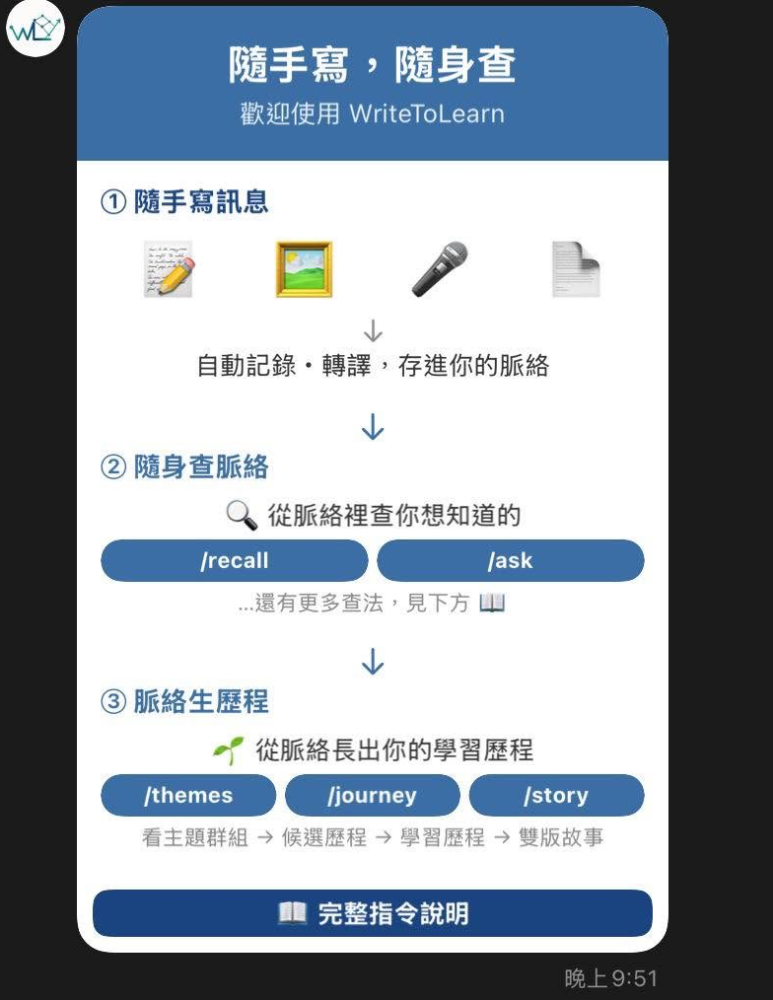

# WriteToLearn｜學生安裝包

把 LINE 變成自己的學習紀錄器：傳文字、照片、語音、影片或檔案給 Bot，系統會把內容保存到你自己的 Google Drive，並支援搜尋、整理主題與產出學習歷程。

這個 repository 是課程用的**自助安裝包**。每位學生都會建立自己的 LINE Bot、Google Apps Script 專案、Gemini API key 與 Drive 資料夾；彼此的資料與費用不共用。

> 請不要把任何金鑰、token、部署網址或同學資料提交到 GitHub。它們只應填在自己 Apps Script 的 Script Properties。

## 這個工具在做什麼？

WriteToLearn 的前提很簡單：學習往往藏在零碎時刻——一句感想、一張白板照片、一段語音或一個連結。人不必先替它分類或命名，只要持續記寫；系統會在背後把這些片段整理成可回看的脈絡，讓學習歷程慢慢長出來。

它有三段核心流程：

```text
隨手寫訊息 ──→ 隨身查脈絡 ──→ 脈絡生歷程
LINE 記錄          時間與語意整理       轉折偵測與回顧
```

1. **隨手寫訊息**：直接在 LINE 傳文字、語音、圖片、貼圖、連結或檔案；系統把內容保存到你自己的 Drive，並轉成可理解語意的向量。
2. **隨身查脈絡**：它沿兩條軸整理資料——時間軸把相近時段的記寫形成「敘事片段」；語意軸把談同一件事的記錄形成「進行中脈絡」。
3. **脈絡生歷程**：脈絡需先通過語意密度、意向回返與跨媒介三項條件，才成為候選歷程；再偵測到概念重述、跨主題整合、行動指向或後設反思等學習轉折，才會形成正式學習歷程。

<a href="assets/three-core-flows.png"></a>

<sub>點圖可查看原始尺寸。</sub>

系統不把學習歷程當成分數，而是比較目前記寫與「有意義的學習歷程」之間的差距，協助你看見下一步能補上的部分。

閱讀 [功能架構與資料流](docs/ARCHITECTURE.md)，了解每一層資料、命令和隱私界線，再開始安裝。

## 開始前

預留 45–60 分鐘，並準備：

- 一個可登入 Google Drive 與 Apps Script 的 Google 帳號
- 一個可登入 [LINE Developers Console](https://developers.line.biz/console/) 的 LINE 帳號
- 可用 [Google AI Studio](https://aistudio.google.com/app/apikey) 建立 API key 的 Google 帳號
- 電腦，以及 Node.js 20 以上版本（用來將這份程式推到你的 Apps Script）
- 手機 LINE App（測試 Bot）

## 安裝路線

請照著 [學生完整安裝指南](docs/STUDENT_INSTALL.md) 由上而下操作。完成每個核取方塊再進到下一段；最後你會得到一個能在 LINE 上回覆、記錄並搜尋自己資料的 Bot。

- [安裝前檢查](docs/STUDENT_INSTALL.md#0-安裝前檢查)
- [建立 LINE Messaging API channel](docs/STUDENT_INSTALL.md#1-建立-line-messaging-api-channel)
- [建立 Gemini API key](docs/STUDENT_INSTALL.md#2-建立-gemini-api-key)
- [建立自己的 Apps Script 專案並上傳程式](docs/STUDENT_INSTALL.md#3-建立自己的-apps-script-專案並上傳程式)
- [填入私密設定、授權與測試](docs/STUDENT_INSTALL.md#4-填入私密設定並完成首次授權)
- [部署 Web App，接上 LINE webhook](docs/STUDENT_INSTALL.md#5-部署-web-app並接上-line-webhook)
- [驗收與故障排除](docs/STUDENT_INSTALL.md#6-完成驗收)

## 安裝完成後可以做什麼？

| 在 LINE 輸入 | 作用 |
| --- | --- |
| 直接傳文字、圖片、語音、影片或檔案 | 記錄學習素材 |
| `/now` | 看今天的重點 |
| `/recall 關鍵字` | 從自己的資料中語意搜尋 |
| `/ask 問題` | 以自己紀錄為根據提問 |
| `/themes` | 看主題群組 |
| `/journey` | 看已形成的學習歷程 |
| `/portfolio` | 產出學習歷程總冊 |
| `/help` | 在 LINE 看完整指令 |

## 給助教／維護者

學生安裝的是一人一套、獨立擁有的服務。若需更新程式，請讓學生從自己的 clone 更新，再用 `clasp push` 與既有 deployment 更新；不要共用老師的 LINE token、Gemini key 或 Apps Script 專案。

原始系統說明與技術設計在 `docs/design/`；常見 LINE 平台限制請看 [docs/LINE_GOTCHAS.md](docs/LINE_GOTCHAS.md)。
