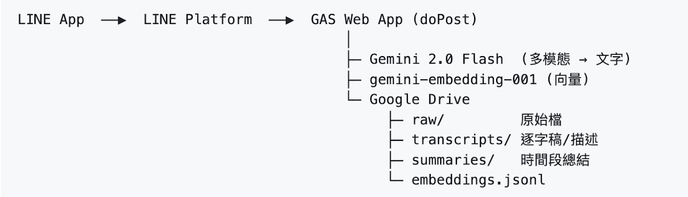
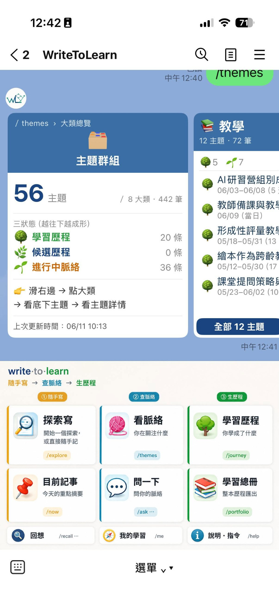
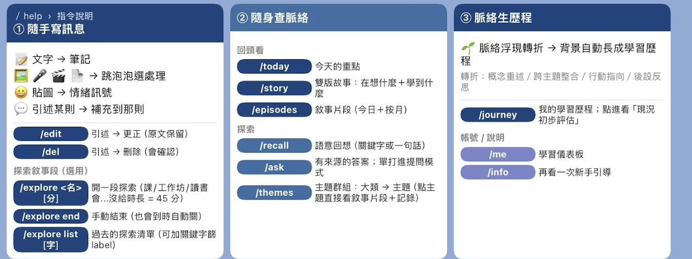
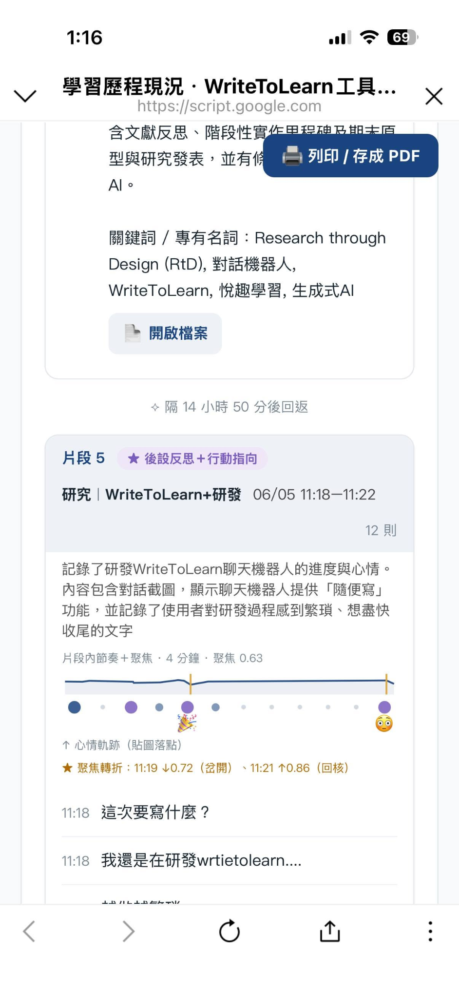
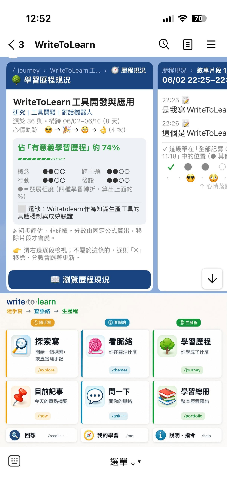

# WriteToLearn 功能架構與資料流

WriteToLearn 是一個把零碎學習記寫逐步整理為可回顧學習歷程的工具。它不要求你先分類、命名或填表；你的工作是記寫，系統的工作是安靜地整理。

<a href="../assets/architecture-flow.png"></a>

## 三段核心

### 1. 隨手寫訊息

你可以從 LINE 傳入文字、圖片、語音、影片、檔案、貼圖或連結。系統會將原始資料保存到**你自己的 Google Drive**；多媒體內容會轉成可搜尋的文字描述或逐字稿，並建立語意向量（embedding）。

這表示系統理解的是大致「在談什麼」，不只是在比對完全相同的關鍵字。

### 2. 隨身查脈絡

系統用兩條互補的整理軸：

| 整理軸 | 形成的內容 | 你可以怎麼看 |
| --- | --- | --- |
| 時間軸 | 相近時間、連續記寫的訊息形成「敘事片段」 | `/now`、`/episodes` |
| 語意軸 | 談同一件事的記錄形成「進行中脈絡」與主題群組 | `/recall`、`/ask`、`/themes` |

兩條軸不互相取代：同一個學習主題可以跨越多個時間片段；同一段時間也可能同時包含不同主題。

<a href="../assets/themes-example.png"></a>

### 3. 脈絡生歷程

不是每個短暫話題都會變成學習歷程。一個進行中脈絡必須先展現：

1. **語意密度**：內容有足夠聚焦，不是一串不相干的訊息。
2. **意向回返**：你在不同時間又回來思考、記寫同一件事。
3. **跨媒介**：你用不只一種形式投入，例如文字加上照片、語音或文件。

符合後成為「候選歷程」。當系統偵測到以下任一種學習轉折，才會升格為正式學習歷程：

- 用自己的話重新說明概念
- 將原本分離的主題連結起來
- 從理解走向具體行動
- 回頭反思自己如何學習

它接著會呈現目前的發展狀態與可補強之處；目的是幫助你看見下一步，而不是替你的學習打分數。

| 指令總覽 | 學習歷程回顧範例 |
| --- | --- |
| <a href="../assets/line-command-guide.png"></a> | <a href="../assets/journey-report-example.png"></a> |

<a href="../assets/journey-detail-example.png"></a>

<sub>所有範例圖皆可點開查看原始尺寸。</sub>

## 資料如何流動

```text
LINE 訊息
  ↓
Apps Script Web App（接收與路由）
  ├─ Google Drive：原始檔、文字轉錄、摘要、個人資料檔
  └─ Gemini：多模態文字化、embedding、主題與轉折推論
  ↓
記錄 → 敘事片段／主題群組 → 進行中脈絡 → 候選歷程 → 學習歷程
  ↓
LINE 查詢、回顧卡片與 `/portfolio` 總冊
```

## 你的資料與權限

- 每位學生都必須建立自己的 LINE channel、Apps Script 專案、Gemini API key 與 Drive 資料夾。
- 記錄保存在各自帳號的 Drive，不會寫入老師的資料夾。
- API key、LINE access token、Apps Script 專案 ID、部署網址及 LINE user ID 都是私密資料；不可放進 GitHub 或群組訊息。
- Webhook 必須公開可呼叫，這是 LINE 能送入訊息的必要條件；完成安裝後應設定 owner，避免陌生人使用你的 Bot。

完成概念理解後，請回到 [學生完整安裝指南](STUDENT_INSTALL.md) 建立自己的版本。
